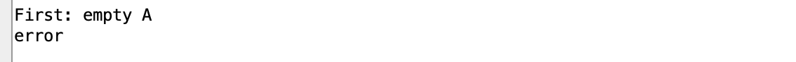
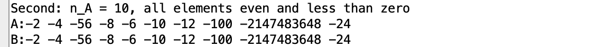
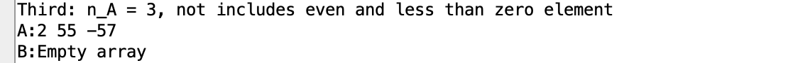
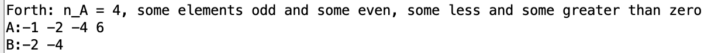
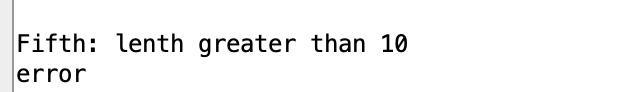

# Assembler_MakingArrayFromSelectedElementsOtherArray
Прозорский Михаил Алексеевич
БПИ224
38 вариант
Разработать программу, которая вводит одномерный массив A, со- стоящий из N элементов (значение N вводится при выполненпии про- граммы),после чего формирует из элементов массива A новый массив B по правилам, указанным в варианте, и выводит его. Память под мас- сивы может выделяться статически, на стеке, автоматичеси по выбору разработчика с учетом требований к оценке работы.
При решении задачи необходимо использовать подпрограммы для ре- ализации ввода, вывода и формирования нового массива массива. Допу- стимы (при необходимости) дополнительные подпрограммы.
Максимальное количество элементов в массиве не должно превышать 10 (ограничение обуславливается вводом данных с клавиатуры). При этом необходимо обрабатывать некорректные значения как для нижней, так и для верхней границ массивов в зависимости от условия задачи.
Сформировать массив B из элементов массива A, которые одно- временно имеют четные и отрицательные значения.
Тесты в файле test

Программы в файле program

## Решение
Для выполнения задачи была разработана программа на языке ассемблера RISC-V. Программа использует соглашения и инструкции, характерные для архитектуры RISC-V.Программа содержит тсетовые файлы,где тестовые ситуации создаются сами, а также основную программу, в которой пользователь может веести свои данные. Программа работает следующим образом:

Программа начинается с ввода размера массива n с помощью системных вызовов. Пользователь вводит целое число, представляющее размер массива.
Затем программа проверяет корректность ввода N. Если N меньше 1 или больше 10, программа переходит к обработке ошибки.
После успешного ввода N, программа вводит элементы массива array. Для этого она использует цикл, сохраняя каждый элемент в массиве array.
Далее, программа проходит по массиву array и проверяет каждый его элемент на соответствие озвученным условиям. Если элемент удовлетворяет им, то она записывает его в массив arrayB.
Наконец, программа выводит массив на экран с помощью системных вызовов, обёрнутых макросами.
Программа содержит библиотеки с макросами. Содержит макросы, являющиеся обертками над функциями, описанными в new_macro.s,а также библиотеку macrolib.s, которая изменяется для случая файлов с тестами.
В случае с говыми тестами добавляется дополнительная подпрограмма в файл main.s, которая заполняет массив array заранее заданными числами.
